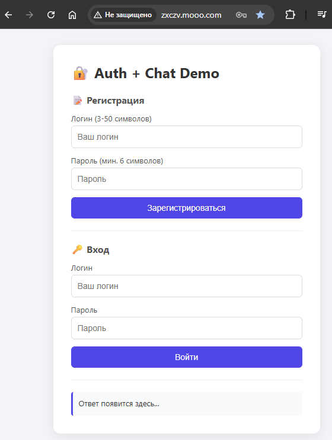
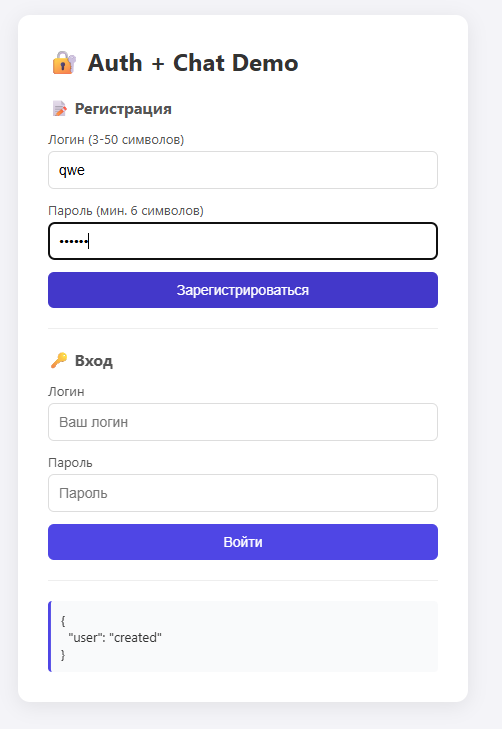
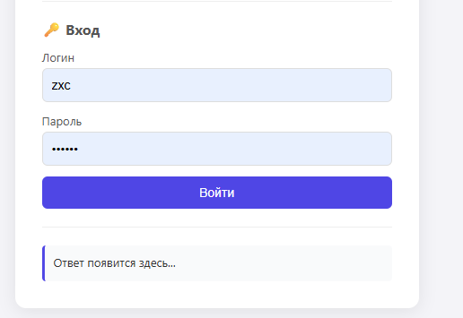
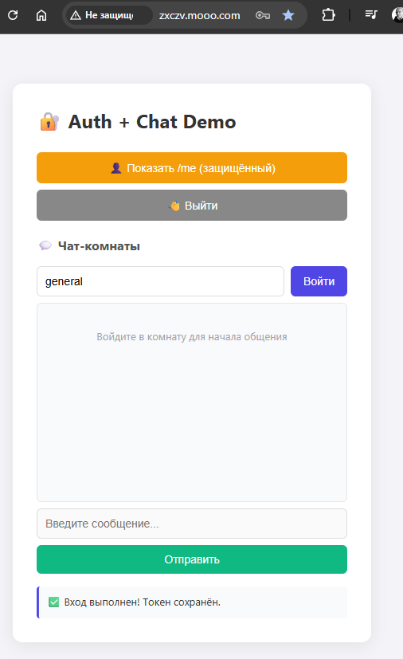
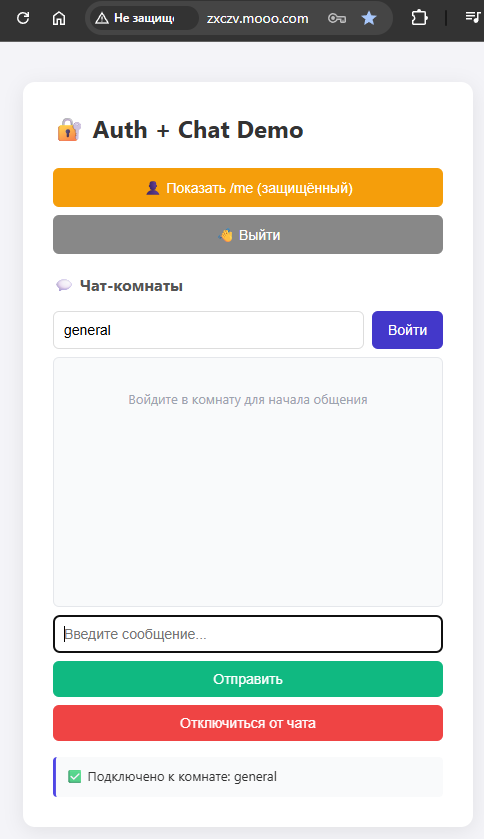
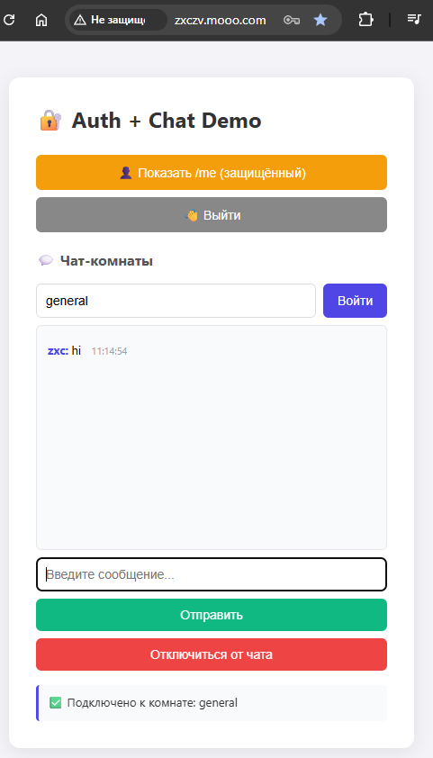
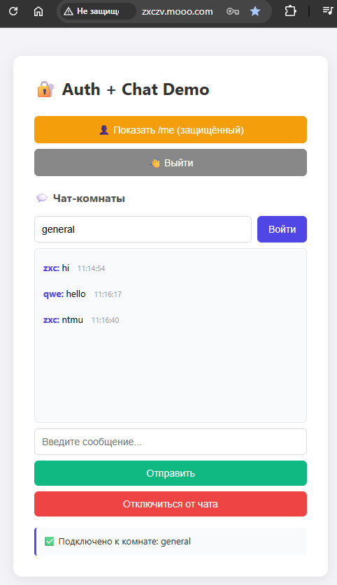
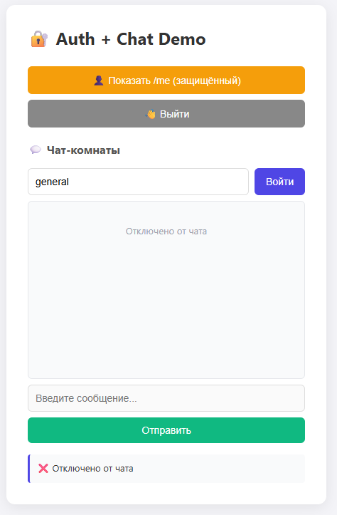
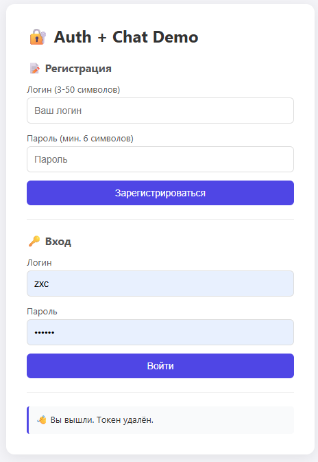

# 🔐 Auth + Chat Demo

Веб-приложение для авторизации и общения в чат-комнатах в реальном времени.

## 🌐 Ссылки на проект
* **Демо-версия:** [zxczv.mooo.com](http://mooo.com)
* **Прямой IP-адрес:** [http://176.119.159.166/](http://176.119.159.166/)

---

## 🚀 Функционал и интерфейс

### 1. Авторизация и аутентификация
При первом заходе на сайт пользователю доступна форма регистрации и входа.
* **Регистрация:** Логин (от 3 до 50 символов) и пароль (минимум 6 символов).
* **Вход:** Авторизация по созданным данным.

<p align="center">
  
  
  
</p>

### 2. Выбор чат-комнаты
После успешного входа открывается панель управления аккаунтом (доступ к защищенному эндпоинту `/me`) и список чат-комнат. Для начала общения необходимо ввести название комнаты (например, `general`) и нажать кнопку «Войти».

<p align="center">
  
</p>

### 3. Общение в реальном времени
После подключения к комнате пользователь может:
* Отправлять текстовые сообщения.
* Мгновенно получать сообщения от других участников.
* Отключаться от чата с помощью специальной кнопки.

<p align="center">
  
  
</p>

### 4. Очистка истории при выходе
При нажатии кнопки «Отключиться от чата» или выходе из комнаты текущие сообщения локально стираются с экрана в целях конфиденциальности.

<p align="center">
  
  
  
</p>

---

## 🛠 Инструкция по локальному запуску

Для работы проекта используется быстрый менеджер пакетов [uv](https://github.com).

### 1. Подготовка окружения
Установите `uv`, если он у вас еще не установлен, и клонируйте репозиторий:

```bash
# Клонирование репозитория
git clone git@github.com:toxxarr3/auth_and_chat.git

# Переход в папку проекта
cd auth_and_chat
```

 ### Настройте Переменные окружения в .env.py и потом уберите точку в начале

```bash
mv .env.py env.py
```

### 2. Инициализация базы данных
Перед первым запуском необходимо создать и настроить базу данных:

```bash
uv run database.py
```

### 3. Запуск приложения
Запустите основной файл для старта сервера:

```bash
uv run main.py
```

После этого откройте в браузере адрес, указанный в консоли (обычно `http://127.0.0.1:8000`).
